<p align="center">
  
  <br>
</p>
<h3 align="center">
  Seu novo carro te espera aqui!
</h3>

<p align="center">
  
  
  
  
</p>

<p align="center">
  <a href="#sobre">Sobre</a> •
  <a href="#rentx">RentX</a> •
  <a href="#instalação">Instalação</a> •
  <a href="#tecnologias">Tecnologias</a> •
  <a href="#autor">Autor</a>  
</p>

## Sobre

Projeto desenvolvido durante o bootcamp da Ignite da Rocketseat durante a trilha de React Native.

## RentX

O RentX é um app de locação de automóveis. Trata-se de uma aplicação mobile criado com React Native e Typescript.

Ao acessar o app pela primeira vez o usuário irá se deparar com a tela abaixo, onde poderá realizar login ou criar uma conta caso não tenha:

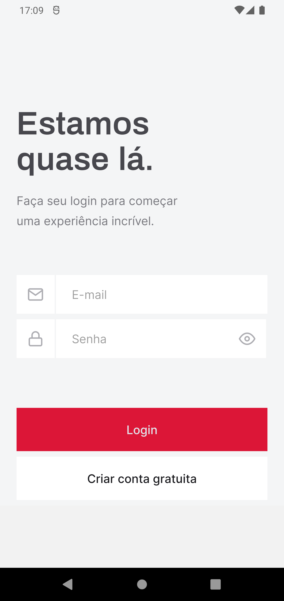

Supondo que ele não possua conta ainda, vamos conhecer o fluxo de cadastro do app. As imagens a seguir compõem o fluxo de registro e estão ordenadas em seu fluxo natural do app:

|                               Dados Pessoais                               |                               Definição de senha                               |                                   Visualização das senhas                                   |                               Confirmação de cadastro                               |
| :------------------------------------------------------------------------: | :----------------------------------------------------------------------------: | :-----------------------------------------------------------------------------------------: | :---------------------------------------------------------------------------------: |
| 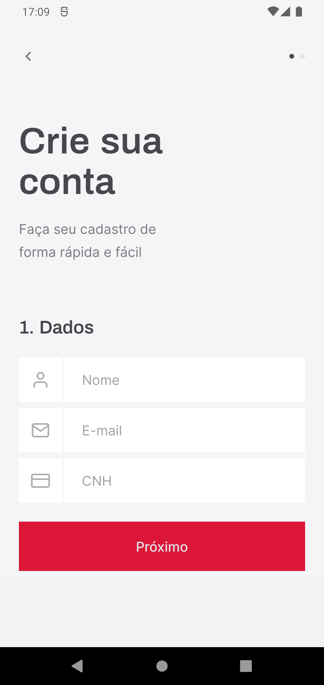 | 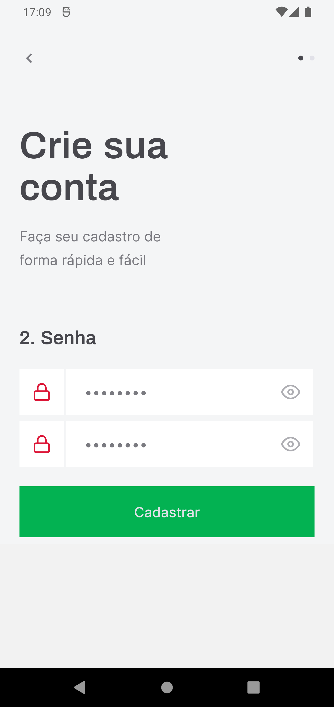 | 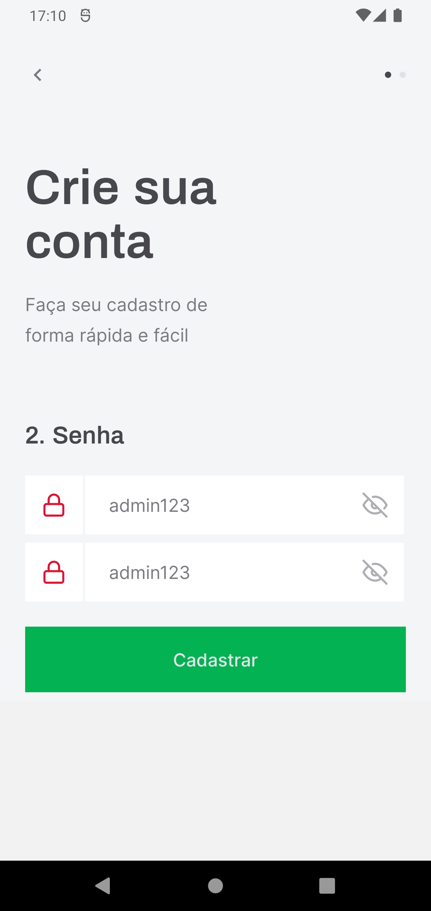 | 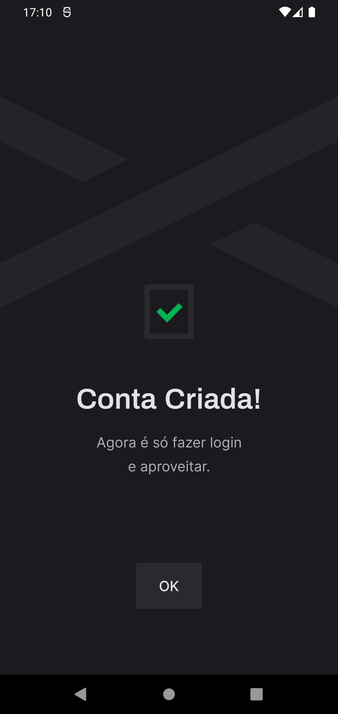 |

Após criar a conta e acessa-la através da tela de login mostrada anteriormente, o usuário será direcionado para a home do app, visualização semelhante ao exemplo abaixo:

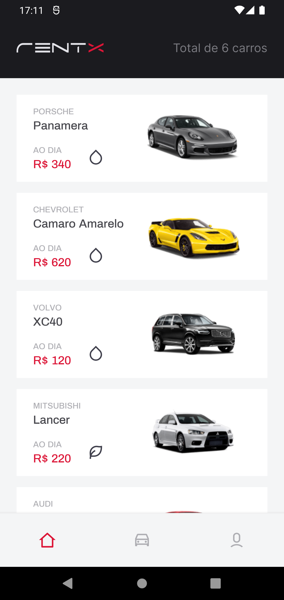

É na home aonde o usuário fica ciente de quantos e quais carros estão disponíveis para locação. Após navegar pelas opções e se interessar por um dos carros, o usuário pode clicar no card para ver mais detalhes do automóvel, como: descrição, preço, fotos e acessórios. Abaixo um exemplo dos detalhes de um dos carros:

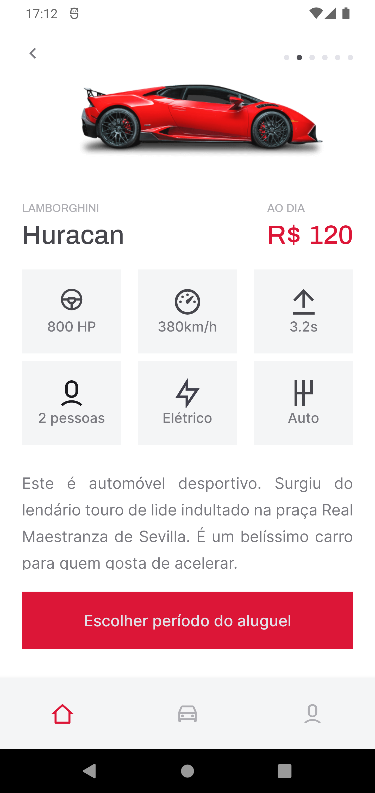

Estando de acordo com os valores e gostando do veiculo, o usuário pode clicar no botão `Escolher período do aluguel` para ver as datas disponíveis e escolher o período em que deseja alugar o carro:

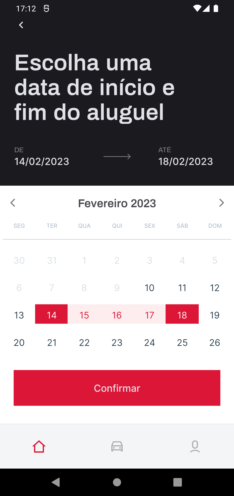

Após a definição do período, o usuário verá uma tela de confirmação com os detalhes da locação que está prestes a concluir e estando de acordo com os detalhes basta ele finalizar o agendamento e o aluguel já estará registrado na plataforma. Esse fluxo está ilustrado nas próximas capturas de telas:

|                               Detalhes da locação                                |                                  Preço da locação                                   |                            Confirmação da locação                            |
| :------------------------------------------------------------------------------: | :---------------------------------------------------------------------------------: | :--------------------------------------------------------------------------: |
| 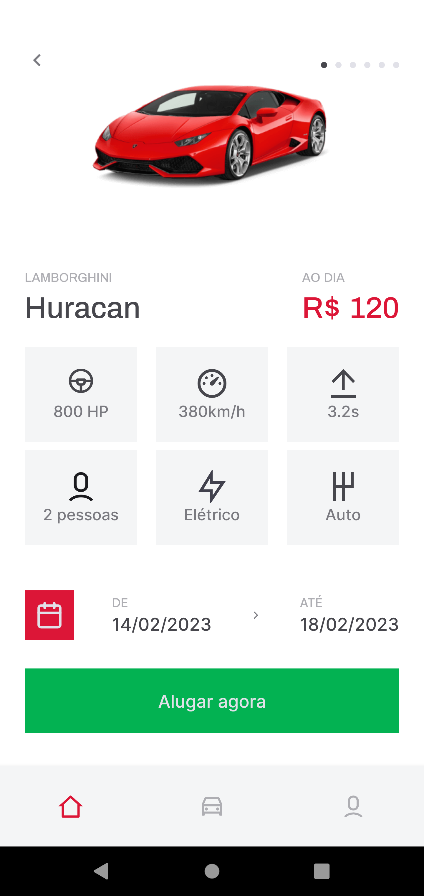 | 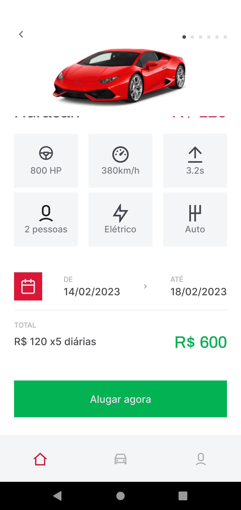 | 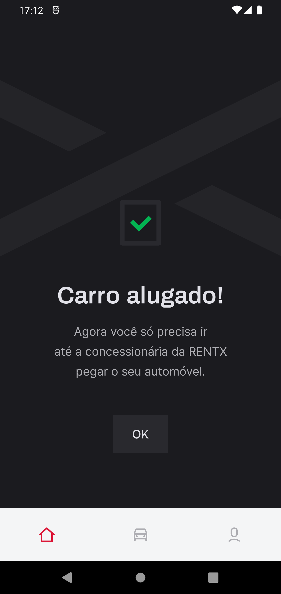 |

Agora que vimos como realizar uma locação, vamos conhecer aonde podemos consulta-las. Na home do aplicativo, na parte inferior da tela, temos nosso menu de navegação. Ao clicar na opção do meio, o usuário será direcionado para os seus agendamentos, onde terá a sua disposição informações do total de alugueis agendados, quais os carros desejados, o valor da diária e período desejado para cada um dos automóveis, como podemos ver abaixo:


A ultima opção do menu contem o perfil do usuário e a opção para deslogar do app. Abaixo temos esse fluxo ilustrado, onde:

- Primeira imagem: Mostra o perfil do usuário, onde ele pode por exemplo alterar sua foto de perfil e o número de sua CNH.
- Segunda imagem: Opção para o usuário alterar a sua senha de acesso.
- Terceira imagem: Ao clicar no botão localizado no canto superior direito, a mensagem da imagem é exibida pro usuário antes do logoff ser realizado.

|                             Dados do usuário                              |                                 Alteração de senha                                 |                             Confirmação para logout                              |
| :-----------------------------------------------------------------------: | :--------------------------------------------------------------------------------: | :------------------------------------------------------------------------------: |
| 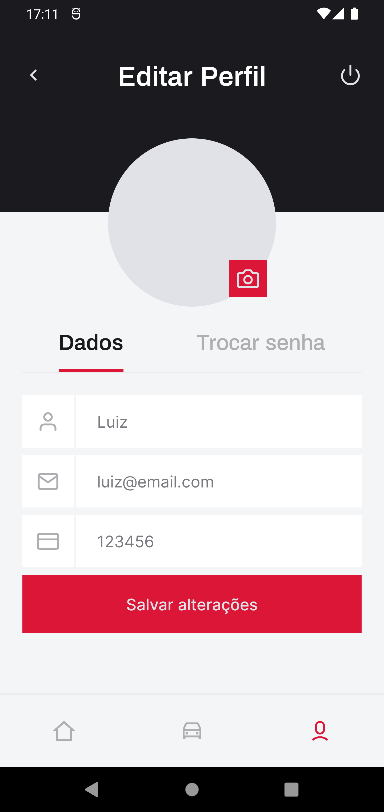 | 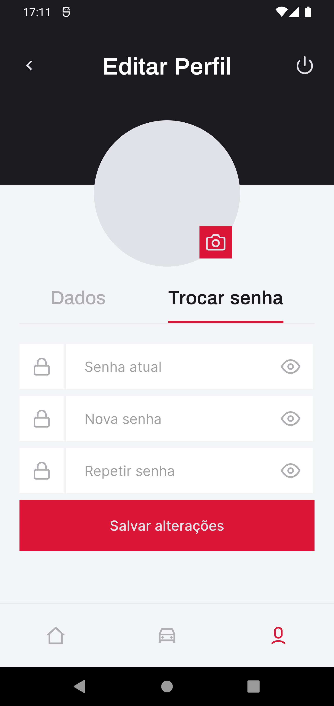 | 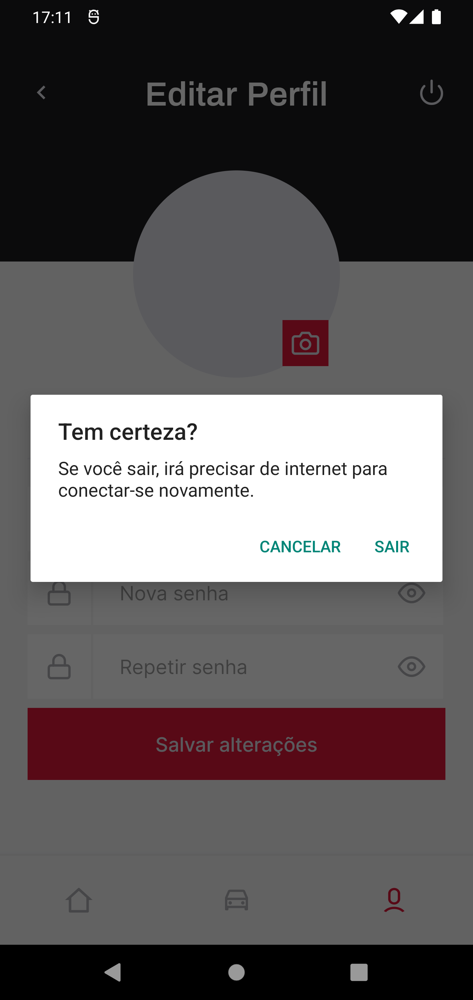 |

E esse é o app do RentX, simples e objetivo porém atendendo aos requisitos que lhe foi imposto. Deixo abaixo uma demonstração do app em funcionamento onde navego por todas as funcionalidades disponíveis no app para fins demonstrativos:


## Instalação

Antes de começar, você vai precisar ter instalado em sua máquina as seguintes ferramentas:
[Git](https://git-scm.com) e [Node.js](https://nodejs.org/en/). Além disto é bom ter um editor para trabalhar com o código como [VSCode](https://code.visualstudio.com/).

### 📱 Rodando o App

```bash
# Clone este repositório
$ git clone git@github.com:MrRioja/rentxApp.git

# Acesse a pasta do projeto no terminal/cmd
$ cd rentxApp

# Instale as dependências
$ npm install
# Caso prefira usar o Yarn execute o comando abaixo
$ yarn

# Execute a API da aplicação feita com JSON Server
$ yarn api

# Execute a aplicação no emulador android
$ yarn android

# Execute a aplicação no emulador iOS
$ yarn ios
```

## Tecnologias

[](https://skillicons.dev)

## Autor

<div align="center">

<h1>Luiz Rioja</h1>
<strong>Backend Developer</strong>
<br/>
<br/>

<a href="https://linkedin.com/in/luizrioja" target="_blank">

</a>

<a href="https://github.com/mrrioja" target="_blank">

</a>

<a href="mailto:lulyrioja@gmail.com?subject=Fala%20Dev" target="_blank">

</a>

<a href="https://api.whatsapp.com/send?phone=5511933572652" target="_blank">

</a>

<a href="https://join.skype.com/invite/tvBbOq03j5Uu" target="_blank">

</a>

<br/>
<br/>
</div>
